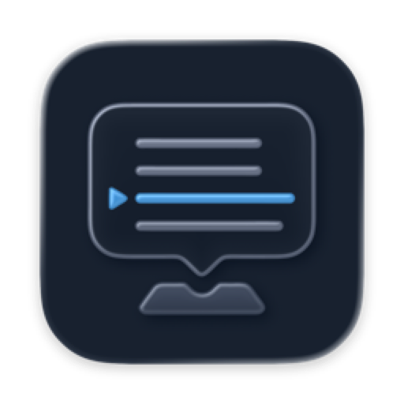

<p align="center">
  
</p>

<h1 align="center">TelepromptMe</h1>

TelepromptMe is a native macOS teleprompter built for people who speak to a camera. It keeps a script in a compact floating overlay near the camera and scrolls it at a comfortable, adjustable pace.

> [!IMPORTANT]
> TelepromptMe is an early work in progress. The core workflow is usable, but the app is not yet ready for general distribution and interfaces may change without notice.

## What works today

- Create, edit, organize, favorite, and locally persist scripts.
- Open a script in a floating overlay that stays available across spaces and fullscreen apps.
- Play, pause, restart, and adjust automatic scrolling by words per minute.
- Customize overlay typography, line spacing, and opacity.
- Customize focused global shortcuts for overlay visibility, playback, and restart.

For a more detailed implementation inventory, see [Current Functionality](docs/current-functionality.md).

## Project status

The current focus is stabilizing the essential script-to-overlay journey, preventing data loss, and validating direct distribution.

This repository is public as a build-in-public project: it shows the real implementation and its progress, not a finished product. Bug reports and thoughtful feedback are welcome, but there are currently no prebuilt releases or support guarantees.

## Requirements

- An Apple silicon Mac
- macOS 26 or later
- Xcode 26 or later

## Build from source

```bash
git clone https://github.com/denyspupin/teleprompt-me.git
cd teleprompt-me
open TelepromptMe.xcodeproj
```

Then select the `TelepromptMe` scheme in Xcode and run the app. You can also build from the command line:

```bash
xcodebuild -project TelepromptMe.xcodeproj \
  -scheme TelepromptMe \
  -configuration Debug \
  build
```

## Privacy

Scripts and settings are stored locally. The v1 app does not need microphone, speech-recognition, or network access.

## Repository guide

- `TelepromptMe/App` — app lifecycle and shared state
- `TelepromptMe/Core` — persisted and domain models
- `TelepromptMe/Features` — library, editor, overlay, and settings UI
- `TelepromptMe/Shared/Services` — playback, persistence, overlay, and shortcuts
- `TelepromptMeTests` — playback and script-library tests
- `docs` — current capability and distribution notes
- `scripts` — packaging automation

## Contributing

TelepromptMe is currently a personal, in-progress project, but focused bug reports and small pull requests are welcome. Please open an issue before investing in a large change so the direction can be discussed first. See [CONTRIBUTING.md](CONTRIBUTING.md) for the development workflow.

## License

No open-source license has been selected yet. The source is public for transparency and learning, but no permission to copy, modify, or redistribute it is granted at this time.
